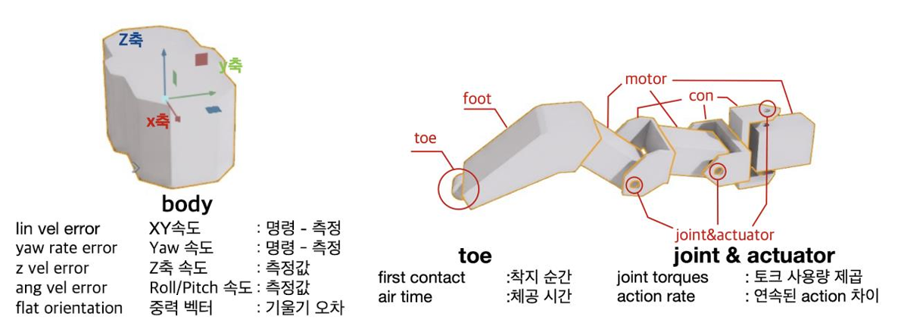

# EUREKA를 활용한 헥사포드 로봇의 험지 보행 강화학습
Validation of EUREKA’s Effectiveness in Hexapod Rough-Terrain Locomotion

## Simulation

### Overview

2023년 MIT에서 발표한 대규모 언어모델 기반 보상 함수 설계 자동화 프레임워크인 EUREKA를 활용하여 헥사포드 로봇에 적용 가능성을 검토한다. 이를 통해 EUREKA 프레임워크의 적용 범위를 더 높은 복잡성을 지닌 로봇 시스템으로 확장하여 향후 지능형 다족 로봇의 자율 보행 연구에 기여하고자 한다. 

---

### Fidelity

1. 시뮬레이션 환경은 Isaac Lab에 구현한다.
2. 학습은 오픈소스 DIY 모델을 단순화한 3D 모델링을 활용한다.
3. 성능 향상에 대한 척도는 전진 속도(Forward Velocity)로 한정한다.
4. 강화학습 하이퍼파라미터는 본 EUREKA 연구와 동일하게 설정한다.

---

### Solution Approach

#### 1. 3D Modeling
 
선정한 오픈소스 DIY 모델을 시뮬레이션 환경에 맞게끔 곡선은 배제하고 나사같은 미세 부품들을 제거하는 방식으로 단순화 작업을 거쳤다. 총 무게에서 브림과 사용자 정의 부분을 제외하여 실제 무게를 계산.
 

  

    
    
  

---

#### 2. Motor & DCMotorCfg
 
모터 : 선정된 모터는 MG996R이며 주요 사양은 무게 55g, 토크 11kgfcm, 작동 속도 7.47rad/s이다.

DCMotorCfg : 로봇 Actuator의 제어 설정을 정의하는 함수로 각 파라미터의 상세 설명은 다음과 같다.
* **joint_names_expr**=[".*hip", ".*knee", ".*ankle"] : "hip", "knee", "ankle"을 이름에 포함하는 모든 관절에 이 설정이 적용된다.
* **saturation_effort=1.0** : 모터에 가해질 수 있는 최대 입력값의 정규화 범위를 정의한다.
* **effort_limit=0.5** : 제어 입력의 정규화된 최대값(±1)이 실제 물리적 토크 한계로 변환된다. 
* **velocity_limit=7.47** : 각 관절이 낼 수 있는 최대 속도(rad/s)를 설정한다. 
* **stiffness={".*": 10.0}** : 관절의 위치 제어를 위한 비례 이득(k_p)을 설정한다.
* **damping={".*": 0.3}** : 관절의 속도에 대한 저항 계수(k_d)를 설정한다.

 

---

#### 3. Sensor & Reward Components
 

  

    
  

헥사포드의 중앙 부분을 body 로 지정하고, body 를 기준으로 각 값을 읽어와 보상 구성요소에 
사용하였다. 각 다리의 끝 부분은 toe 로 명명하고 접촉 센서를 부착하여 착지 순간을 인식하고 체공 
시간을 계산한다. 
각 관절의 revolute joint(위 이미지의 joint&actuator)에서 현재 토크 값과 이전 토크 값을 읽어온다. 

---

#### 4. Code Explanation
 
* **Hexapod.py** : revolute joint 에 모터를 부착하고 물리값을 설정하였다. 또한 모델 경로 지정, 중력 등 물리 속성 부여, 초기 위치 및 각 조인트 각도 설정 등 학습에 사용되는 에이전트인 헥사포드를 설정.

* **hexapod_env_cfg.py** : 지형을 불러오고 그에 대한 파라미터를 설정. 과적합 방지를 위해 
지형과 모델의 물리값에 약간의 랜덤 값을 부여하였으며, 다중 환경 파라미터와 시뮬레이션 코드도 작성하는 등 학습에 필요한 환경과 모델의 파라미터를 설정하였다.

* **hexapod_env.py** : 헥사포드 학습에 사용할 목표 속도를 랜덤으로 부여하고, 보상을 기록하며 로봇을 생성하고 시뮬레이션 환경을 생성한다. 에이전트의 종료 조건과 환경 리셋 등 실질적으로 학습에 
필요한 환경들을 생성하고 각 Iteration에서의 학습을 담당하는 코드를 작성했다. 

---

#### 5. Results
 

##### 1. EUREKA 회차 간 비교
EUREKA 의 보상 평가, 수정 시스템이 헥사포드의 제대로 작동하였는지 알아보기 위해 첫 번째와 다섯 번째 회차를 비교하고자 한다. 한 번의 회차에는 세 개의 샘플이 사용되었으며 각각의 샘플로 2000 번의 강화학습을 진행했다. 그 중 다음 보상을 생성하는 프롬프트 입력값으로 이용된 샘플을 평가 기준으로 선정하였다. 전진속도를 최대화시키라는 명령을 task description 으로 제공했기 때문에 속도는 로봇의 전방인 x 축 방향 속도를 기준으로 측정하였다. 에이전트의 생성부터 소멸까지 최대 20 초간 헥사포드의 평균 속도를 기준으로 속도를 측정하였다.

실험 결과 첫 번째 회차에서 생성된 보상함수로 학습된 헥사포드 로봇의 x 축 속도는 -0.1~0.05m/s 
사이를 오갔다. 이는 시뮬레이션을 통해 육안으로 확인했을 때 바닥에 달라붙어 거의 움직임이 없는 
모습으로 나타났다.
 

  

    
  

반면 네 번의 수정을 추가적으로 거친 보상함수로 학습된 로봇의 경우 평균 x축 속도가 초기 500 번의 학습 이내에 0.6m/s 까지 상승하였으며, 이후의 학습에서 최대 0.78m/s 까지 상승하였다. 시뮬레이션을 통해 육안으로 확인한 결과도 보행이라고 부를수 있는 깔끔한 이동을 보였다.

 

  

    
  

이런 데이터의 경향은 EUREKA 가 피드백을 통해 보상함수를 성공적으로 개선한다는 것을 나타낸다. 또한, 
다양한 환경에서 속력이 크게 차이나지 않는 것을 통해 개선된 보상함수가 다양한 험지를 효과적으로 
주파할 수 있음이 나타났다. 

---

##### 2. 유효성 검증 
앞서 EUREKA 가 보상함수를 성공적으로 개선한다는 것을 확인한 반면 이번에는 그렇게 개선된 보상함수가 인간 설계자가 설계한 보상 함수와 비교하여 어느 정도의 성능을 가지는지 알아보고자 한다. IsaacLab 은 헥사포드에 대한 기본적인 예시 학습 환경을 제공하지 않으며, IsaacLab 을 적용하는 헥사포드의 학습 파일을 찾을 수 없었기에 학습 환경을 직접 작성하였다.보상 함수만을 비교할 수 있는 명확한 기준이 존재하지 않는다. 따라서 본 연구에서는 앞서 살펴본 실험 결과와 다른 연구에서 제공하는 데이터를 이용한 정성적 분석을 통해 유효성을 살펴보고자 한다. 

 

보행 알고리즘의 성능을 비교하기 위해서는 몸체 길이와 이동속도의 비율로 정규화 된 수치를 
성능을 확인하기 위한 지표로 이용하는 것이 타당하다. 본 연구에서 이용한 헥사포드 로봇의 바디 전후 
길이는 18.8cm이므로 로봇의 최종 전진 속도는 바디 기준 약 4.15BL/s(body lengths per second)가 된다. 

주행속도에 초점을 맞춘 또 다른 연구에서는 고전적 알고리즘으로 우선적으로 학습시킨 신경망에 
강화학습을 적용한 결과 헥사포드가 최대 2m/s 를 보이는 것을 확인할 수 있었다. 연구 영상에서 확인할 
수 있는 해당 로봇의 몸체 길이는 1m 이며 몸체 길이에 상대적인 속도는 2BL/s 가 된다. 이는 다른 알고리즘을 적용한 동급의 로봇에 비해 유의미하게 빠른 주행 성능이라고 해당 논문에서 언급된다.  

비록 로봇의 동체 속도와 무게가 로봇의 크기에 비례한 속도에 영향을 미치지만, 이는 작은 로봇이 
가벼운 몸체와 모터의 파워를 이용하여 스스로의 몸을 앞으로 발사하거나, 몸을 공중에 띄워 이동 
속력을 최대화 시키기 때문이다. 따라서 로봇이 보행을 통해 전진했다는 점을 미루어 보았을 때 5 배 
작은 헥사포드가 4.15BL/s로 이동하는 것은 괜찮은 수준의 보상 함수 생성을 달성했다 판단된다.

